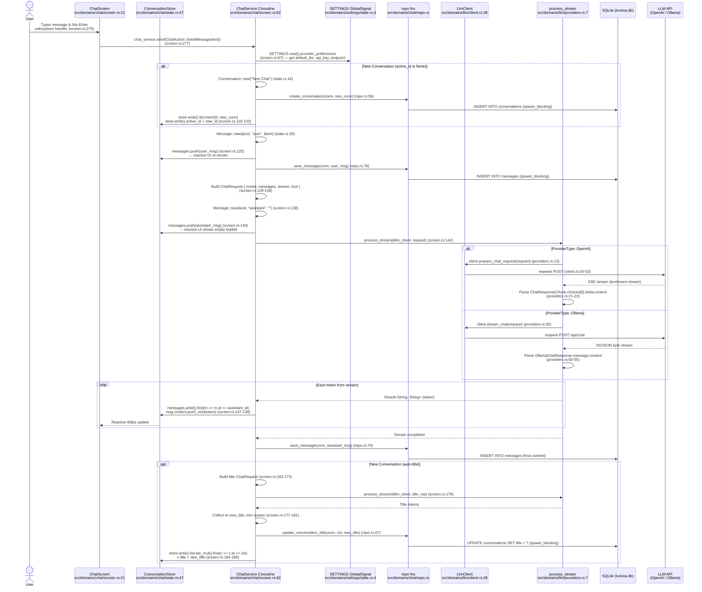
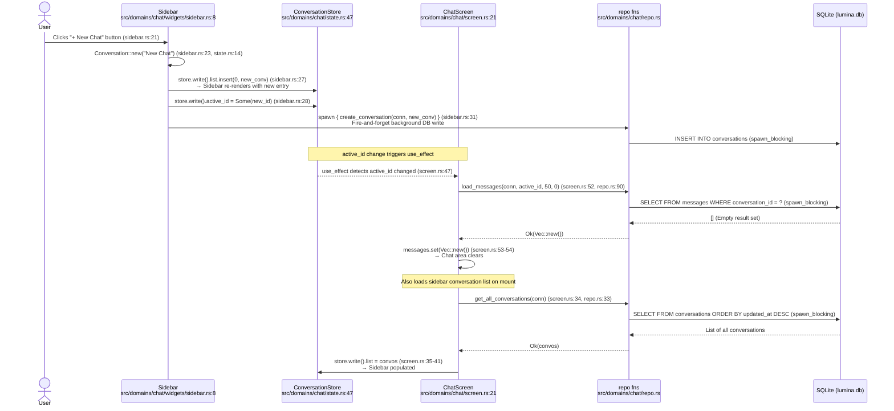

# Lumina

Lumina is a next-generation, local-first LLM application designed to unify the best interaction patterns from **Gemini**, **Claude Desktop**, and **NotebookLM**. It provides a cohesive, source-grounded workspace for research, coding, and general assistance, built entirely in **Rust** with **Dioxus 0.7**.

## 🌟 The Vision

Lumina bridges the gap between three industry-leading interaction models:

- **Interaction (Gemini Style):** A fluid, multi-modal chat interface focused on speed and ergonomics.
- **Extensibility (Claude Style):** Deep integration with the **Model Context Protocol (MCP)** for local tool use and system-wide intelligence.
- **Grounding (NotebookLM Style):** A source-centric workspace where AI responses are grounded in your specific documents with verifiable, clickable citations.

## 🏗️ Architecture & Tech Stack

Lumina is built for performance, privacy, and portability.

- **Framework:** [Dioxus 0.7](https://dioxuslabs.com/) (Rust)
- **Rendering:** System Native WebView (**Approach A**) for minimal footprint (~10MB binary).
- **Styling:** Tailwind CSS v4.
- **Reactivity:** Dioxus Signals (`use_signal`, `Store`).
- **Protocol:** [Model Context Protocol (MCP)](https://modelcontextprotocol.io/) via `rmcp`.
- **Persistence:** Local-only storage using SQLite or SurrealDB.
- **Platforms:** 
  - **Desktop:** Windows, macOS, Linux.
  - **Mobile:** Android (iOS support planned).

## 📁 Folder Structure

We use a **Pragmatic Hybrid (UI-Aware DDD)** architecture. This separates generic frontend UI components from smart business domains, preventing monolithic codebases while keeping Dioxus UI development fast.

```text
src/
├── main.rs                 # Entry point
├── app.rs                  # Global router and layout wrap
├── db.rs                   # Global SQLite connection pool management
├── components/             # SHARED UI: Dumb components only
│   ├── mod.rs
│   ├── buttons.rs
│   ├── layout.rs
│   └── modals.rs
├── domains/                # SMART DOMAINS: DDD boundaries
│   ├── chat/
│   │   ├── mod.rs
│   │   ├── screen.rs       # The Chat page (smart component)
│   │   ├── state.rs        # Global use_signal definitions for chat
│   │   ├── repo.rs         # SQLite queries for chat
│   │   └── widgets/        # Components specific ONLY to chat (e.g., MessageBubble)
│   ├── llm/
│   │   ├── mod.rs
│   │   ├── client.rs       # Base HTTP client / Traits
│   │   ├── providers.rs    # OpenAI, Local implementations
│   │   └── models.rs       # Prompt/Response structs
│   └── settings/
│       ├── screen.rs
│       └── store.rs
└── utils/                  # Generic helpers (formatting, crypto)
```

**Rules of Engagement:**
1. **Dumb UI vs Smart Domains**: Files in `src/components/` must be pure functions/components. They accept props and emit events. They **cannot** access global state, database, or network.
2. **Domain Boundaries**: `src/domains/` owns everything else. A domain can import from `src/components/`, but a component can never import from `src/domains/`.
3. **Cross-Domain Comms**: If `domains/chat/screen.rs` needs to trigger an LLM inference, it calls a function in `domains/llm/client.rs`.


## 📜 Core Principles (The Constitution)

All development on Lumina adheres to our Project Constitution @specify/memory/constitution.md :

1.  **Local-First:** All application logic and data (sessions, sources) stay on your device.
2.  **Cross-Platform Consistency:** A unified UI experience across all devices using shared Dioxus components.
3.  **Modular Extensibility:** Every system-level capability is implemented as an MCP tool.
4.  **Source-Grounded Integrity:** AI outputs must be verifiable via direct citations.

## 🚀 Getting Started

### Prerequisites
- **Rust:** 1.80.0 or newer.
- **Dioxus CLI:** `cargo install dioxus-cli`.
- **System Dependencies (Linux):** `libwebkit2gtk-4.1-dev`, `libgtk-3-dev`, `pkg-config`, `libssl-dev`.
- **Android SDK:** Required for mobile builds.

### Installation & Run

1. **Configure Environment**: Create a `.env` file based on [quickstart.md](specs/002-tracer-bullet/quickstart.md).
2. **Launch Dev Server**:
   ```bash
   # Run the desktop version with hot-reloading
   dx serve
   ```

## 🔄 Core User Flows

### 1. Chat Flow (Message Orchestration)
The diagram below illustrates how Lumina handles a user message using an asynchronous actor model (Dioxus `use_coroutine`) to ensure the UI thread never blocks during SQLite I/O or LLM streaming.



### 2. New Session Flow (Reactive Sidebar)
Creating a new session involves coordinating local reactive state with background database persistence.



## 🗺️ Roadmap

We follow a **"Tracer Bullet" (Vertical Slice)** methodology to ensure the Dioxus UI, database, and asynchronous LLM network calls are constantly integrated, prioritizing a lightweight footprint.

- [X] **Phase 1: The Core Loop (Tracer Bullet)** - End-to-end basic chat input, SQLite persistence, and mocked/basic LLM response stream.
- [X] **Phase 2: Domain Expansion** - Conversation history (sidebar), Settings (API keys), and Model Context Protocol (MCP) foundation.
- [ ] **Phase 3: UX & Performance Polish** - Markdown rendering, 60fps streaming tokens, and memory optimization profiling to guarantee sub-100MB RAM usage.
- [ ] **Phase 4: Distribution** - Automated CI/CD pipelines for cross-platform installers (Windows, Linux, macOS).

## 🧠 Architectural Decisions (Deep Think Context)

To ensure Lumina remains a lightweight, resource-efficient alternative to Electron, we underwent a rigorous "Deep Think" multi-solution analysis to define our core architecture:

1. **Folder Structure (Pragmatic Hybrid DDD):** We chose a hybrid approach that separates "dumb" reusable UI elements (`src/components/`) from smart business domains (`src/domains/`). This balances the realities of Dioxus UI component reuse with the strict backend isolation of Domain-Driven Design. *(Detailed in: [solution_c.md](.tot/folder_structure/solution_c.md))*
2. **Project Roadmap (Tracer Bullets):** Instead of building horizontally (e.g., all UI first, or all Database first), we build end-to-end "Tracer Bullets." Phase 1 immediately proves that async Rust, SQLite disk I/O, and Dioxus UI rendering can work harmoniously without blocking the main thread. *(Detailed in: [solution_c.md](.tot/project_phases/solution_c.md))*
3. **Core Loop Implementation (Actor Model):** To maintain flawless UI performance without disk I/O stuttering, we use an Event-Driven Actor pattern via Dioxus `use_coroutine`. The UI acts as a dumb view sending typed events (e.g., `ChatEvent::SendUserMessage`) to an isolated background orchestrator that handles the heavy SQLite disk writes and HTTP LLM streaming. *(Detailed in: [solution_c.md](.tot/phase_1/solution_c.md))*

---

*Lumina is currently in active development. Built with ❤️ using Rust and Dioxus.*
